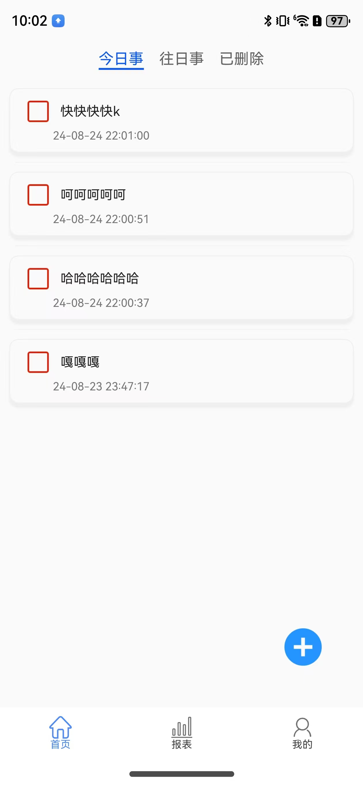
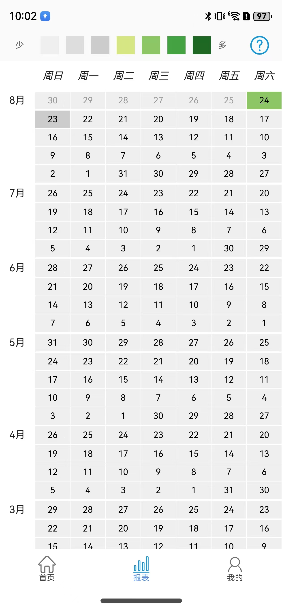
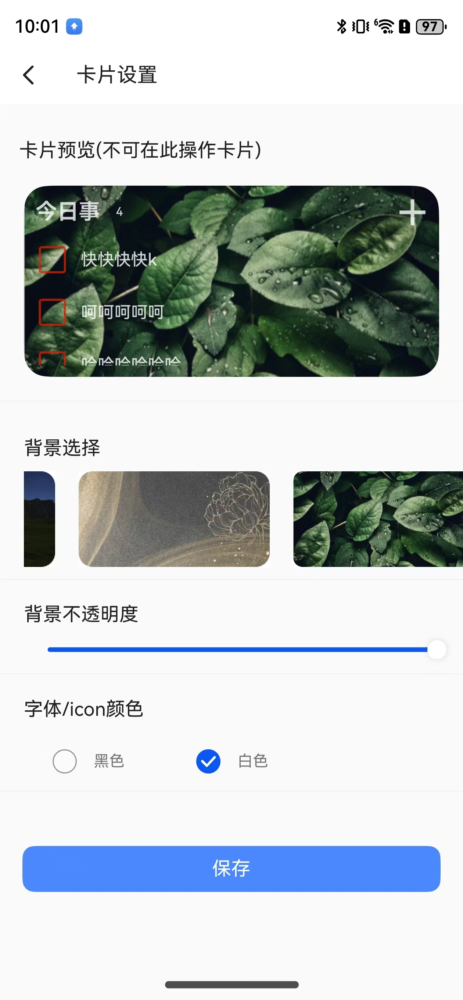

# 今日事笔记(鸿蒙版)
---

## 功能：
 * 待办，增删查改。
 * 报表
 * 桌面卡片，支持样式设置







纯单机应用，通过鸿蒙关系数据库实现数据的增删查改。

基于API12

## 用到的技术点：
* 1、关系数据库：```relationStore```
* 2、卡片服务： ```ExtentionFormAbility```
* 3、App与卡片通信，数据刷新: ```LocalStorageProp```, ```formProvider```
* 4、跨进程通信： ```commonEventManager```。因为卡片组件是被系统使用与展现，context跟app的context没有实时共享数据，所以要用跨进程通信来保存卡片id，确保数据能实时刷新。

安卓版本在其他各大应用市场可下载。
